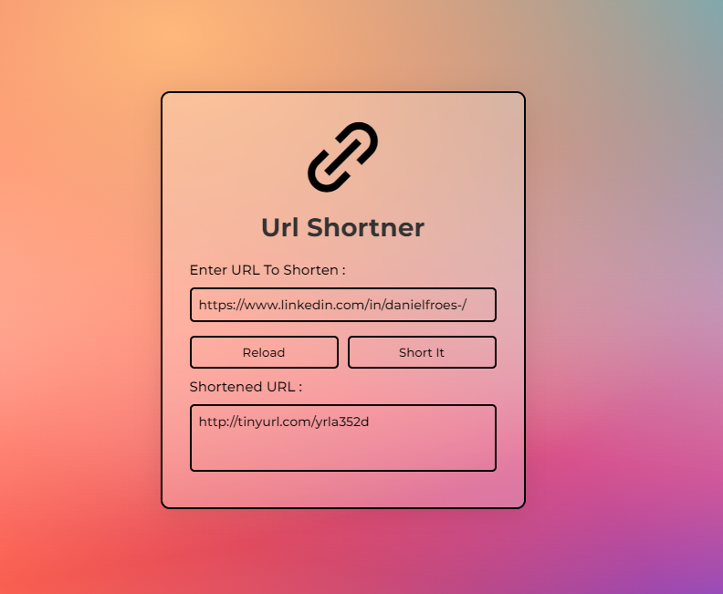

### Encurtador de URL

Neste projeto, vou guiá-lo na criação de um encurtador de URL usando uma API em JavaScript! Adicionalmente, implementamos um design moderno com um atraente fundo de gradiente em malha e elementos de vidro (glassmorphism). A API do site TinyURL foi integrada para fornecer a funcionalidade de encurtamento de URLs❗️

# Screeshot

# Como Funciona
1. **Entrada da URL:** Insira a URL longa que deseja encurtar.
2. **Geração de URL Curta:** Ao clicar no botão, a aplicação utiliza a API do TinyURL para gerar uma versão curta da URL.
3. **Copiar para a Área de Transferência:** A URL curta gerada é exibida e você pode copiá-la facilmente para a área de transferência.

# Tecnologias Utilizadas
- **JavaScript:** Linguagem de programação principal para a lógica do encurtador de URL.
- **API do TinyURL:** Utilizada para encurtar URLs de forma rápida e eficiente.
- **Design Glassmorphism:** Adoção de um design moderno com elementos de vidro para uma experiência visual elegante.

# Como Executar o Projeto
1. Clone este repositório: `git clone https://github.com/seu-usuario/nome-do-repositorio.git`
2. Abra o arquivo `index.html` em seu navegador.

Desfrute de encurtar suas URLs de maneira rápida e estilizada! 🚀